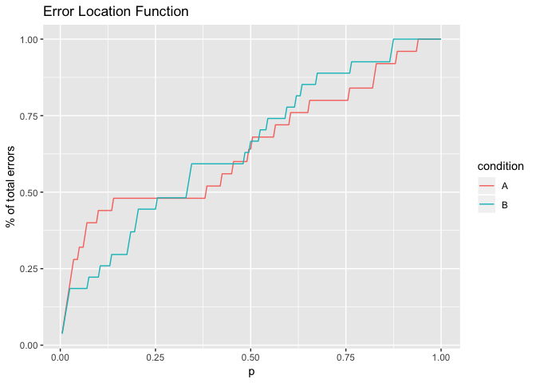
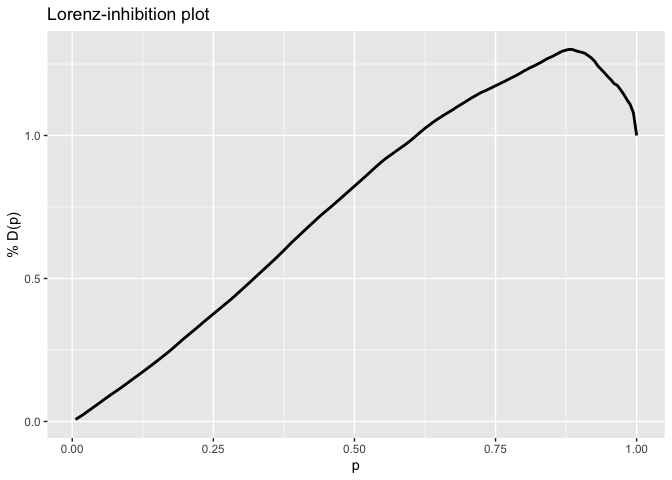

Contents
--------

1.  [Overview](#overview)
2.  [Data](#data)
3.  [ELF](#ELF)
4.  [Interference Distribution Index](#inteference-distribution-index)

# Overview
--------

This package provides tools to analyse response time (RT) distributions
for conflict tasks in R. Specifically, it allows to compute:

-   the Error Location Function and the Error Location Index proposed in
    Servant, M., Gajdos, T., & Davranche, K. (2018). ELF: A new measure
    of response capture. *Psychonomic Bulletin & Review*, 1-9.

-   Interference Distribution Index proposed in Gajdos, T., Servant, M.,
    Hasbroucq, T., & Davranche, K. (2019, december 20). A measure of the
    Interference Effect Distribution.
    <https://doi.org/10.31234/osf.io/7f5n8>

To install, use the following command:

`devtools::install_github("thibault-gajdos/RTconflict")`

# Data
----

We use simulated data for a conflict task.

There are 20 subjects (from 1 to 20), performing a conflict task with
200 congruent and 200 incongruent trials, in two distinct conditions (A
and B). Therefore, there is 800 trials by subject.

    data.conflict %>%
        group_by(compatible, condition) %>%
        summarise(acc = mean(acc), rt = mean(rt))

    # A tibble: 4 x 4
    # Groups:   compatible [2]
      compatible condition   acc    rt
      <fct>      <fct>     <dbl> <dbl>
    1 c          A         0.876 0.494
    2 c          B         0.880 0.493
    3 i          A         0.878 0.516
    4 i          B         0.880 0.515

# Error Location Function
-----------------------

We start with a single subject (subject 1). Error Location Functions are
particularly meaningfull for incongruent trials. With thus restrict
attention to these trials.

First, we compute ELF in each condition.

    d1A <- data.conflict %>% filter(sujet == 1, condition == 'A', compatible == 'i')
    p.1A <- c(1:nrow(d1A))/nrow(d1A)
    elf.1A <- elf(d1A$rt, d1A$acc)
    df1A <- data.frame(elf = elf.1A, p = p.1A)  %>%
        mutate(condition = 'A')

    d1B <- data.conflict %>% filter(sujet == 1, condition == 'B', compatible == 'i')
    elf.1B <- elf(d1B$rt, d1B$acc)
    p.1B <- c(1:nrow(d1B))/nrow(d1B)
    df1B <- data.frame(elf = elf.1B, p = p.1B) %>%
        mutate(condition = 'B')

    df1 <- rbind(df1A, df1B)

We now plot ELF.

    plot.elf1 <- ggplot(data = df1, aes(x = p, y = elf, group = condition, colour = condition)) +
        geom_line() +
        xlab('p') +
        ylab('% of total errors') + 
        ggtitle('Error Location Function')
    plot.elf1

The Error Location Index (ELI) is the area under ELF.

    eli(elf.1A)

    [1] 0.6492

    eli(elf.1B)

    [1] 0.6522222

So, as suggested by the ELF plots, response capture seems larger in
condition B than in condition A. Now, we will turn to aggregate ELF
accross subects.

    dA <- data.conflict %>% filter(compatible == 'i', condition == 'A')
    elf.A <- elf.g(dA$rt, dA$acc, dA$sujet) 

    dB <- data.conflict %>% filter(compatible == 'i', condition == 'B')
    elf.B <- elf.g(dB$rt, dB$acc, dB$sujet)

We can now plot these aggregated ELF functions.

    d <- data.frame(p = c(0:100,0:100), elf = c(elf.A, elf.B), condition = c(rep('A',101),rep('B',101)))

    plot.elf <- ggplot(data = d, aes(x = p, y = elf, group = condition, colour = condition)) +
        geom_line() +
        xlab('p') +
        ylab('% of total errors') + 
        ggtitle('Aggregated Error Location Function')
    plot.elf

# Interference Distribution Index
--------------------------------

To study inhibition, we focus on correct trials. We again start by
focusing on one subject, and this time consider only one condition (A).
We compute the Interference Distribution Index.

    data1A <- data.conflict %>% filter(sujet == 1, condition == 'A', acc == 1)
    LD.1A <- lorenz(data1A$rt, data1A$compatible)
    glimpse(LD.1A)

    List of 2
     $ inhib: num 0.755
     $ q    :'data.frame':  175 obs. of  6 variables:
      ..$ p    : num [1:175] 0.00571 0.01143 0.01714 0.02286 0.02857 ...
      ..$ qc   : num [1:175] 0.327 0.331 0.334 0.338 0.338 ...
      ..$ qi   : num [1:175] 0.365 0.372 0.372 0.382 0.384 ...
      ..$ delta: num [1:175] 0.0377 0.0406 0.0382 0.0443 0.046 ...
      ..$ m    : num [1:175] 0.346 0.352 0.353 0.36 0.361 ...
      ..$ c    : num [1:175] 0.00676 0.01405 0.02091 0.02887 0.03713 ...

As an option, one can specify the quantile method by setting "type" to a
value between 1 and 9, 7 be the default. See the documentation of the
quantile function in R for further details.

LD.1A contains two parts:

-   inhib which is the Lorenz-inhibition index

-   q which contains:

    -   p: quantiles

    -   qc: quantile function for compatible trials

    -   qi: quantile function for incompatible trials

    -   delta = (qi-qc)/2

    -   m = (qc+qi)/2

    -   c = cumulative function of delta

Let's plot the Lorenz-interference plot.

    plot.1A <- ggplot(data = LD.1A$q, aes(x = p, y = c)) +
        geom_line(size = 1) +
        xlab('p') +
        ylab('% D(p)') +
        ggtitle('Lorenz-inhibition plot') 
    plot.1A

Now, let compute an aggregate Lorenz-inhibition plot accross subjects
for each condition. First we compute Lorenz-inhibition plots for each
subject and each condition. Note that it might be the case that
different subjects or conditions have different numbers of quantiles. To
solve this, we constrain the number of quantiles by grouping quantiles
by 1%.

    x  <- NULL 
    for (s in unique(data.conflict$sujet)){
        for (cond in unique(data.conflict$condition)){ 
        d  <- data.conflict %>% filter(sujet == s, condition == cond, acc == 1) 
        xx  <- lorenz(d$rt, d$compatible)$q %>%
                                       mutate(p  = round(p, digits = 2)) %>%
                                       group_by(p) %>% 
                                       summarise(c = mean(c)) %>%
                                       mutate(sujet = s, condition = cond)
        x  <- rbind(x, xx)
        }
    }

Now we aggregate these Lorenz-Delta plots together

    x.ag  <- x %>%
        group_by(p, condition) %>%
        summarise(c = mean(c))

and plot them.

    plot  <- ggplot(data = x.ag, aes(x = p, y = c, group = condition, colour = condition)) +
        geom_line(size = 1) +
        xlab('p') +
        ylab('% D(p)') +
        ggtitle('aggregated  Lorenz-inhibition plot')
    plot

`data.inhib` computes delta plots and the Inhibition Distribution Index
for each subject and each condition.

    data.inhib <- data.conflict %>% filter(acc == 1)
    inhib  <- inhib.delta(rt = data.inhib$rt, comp = data.inhib$compatible, sujet = data.inhib$sujet, cond = data.inhib$condition)

The function generates three data frame: - i: Inhibition Distribution
Index index by subject and condition - delta.slope: slope of the last
segment of the delta plot by subject and condition. This is just for
information, as we strongly advice against the use of this measure.

    glimpse(inhib)

    List of 2
     $ i          :'data.frame':    40 obs. of  3 variables:
      ..$ sujet: Factor w/ 20 levels "1","2","3","5",..: 1 1 2 2 3 3 4 4 5 5 ...
      ..$ cond : Factor w/ 2 levels "A","B": 1 2 1 2 1 2 1 2 1 2 ...
      ..$ index: num [1:40] 0.755 0.603 1.483 0.645 0.853 ...
     $ delta.slope:'data.frame':    40 obs. of  3 variables:
      ..$ sujet: Factor w/ 20 levels "1","2","3","4",..: 1 10 11 12 13 14 15 16 17 18 ...
      ..$ slope: num [1:40] -0.5493 0.0814 0.0715 -0.4077 -0.7678 ...
      ..$ cond : chr [1:40] "A" "A" "A" "A" ...

The mean of the Inhibition Distribution Index index is

    inhib$i %>%  group_by(cond) %>%
        summarise(index = mean(index)) 

    # A tibble: 2 x 2
      cond  index
      <fct> <dbl>
    1 A     0.693
    2 B     0.659
